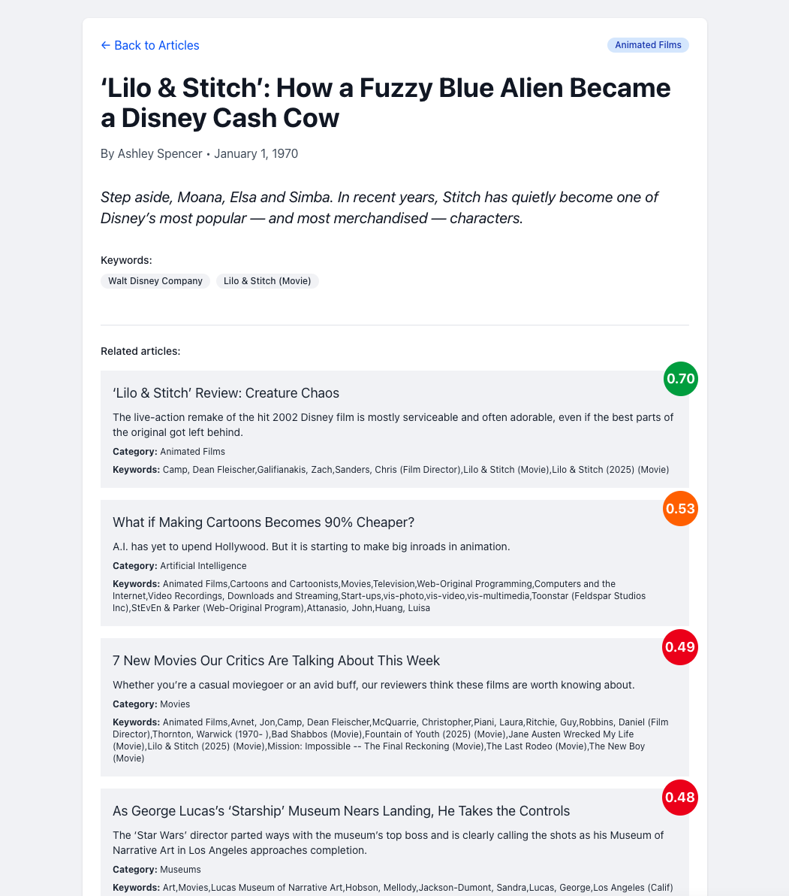

## About this project

This project is an example of how to integrate the [Timm49/similar-content](https://github.com/Timm49/similar-content) package into a Laravel project.

This example focuses on how to use the package to easily add a "Related items recommendation" section to a detail view.
It's a very basic app with news articles like NYT, CNN, etc.
It includes a command which uses the New York Times RSS feed to populate the database with dummy data.
An example of the recommendation section can be found on an article detail route: /articles/{slug}

## Installation

Clone via git

```bash
git clone https://github.com/Timm49/example-app-similar-content
```

Composer installation
```bash
composer install
```
Run migrations
```bash
php artisan migrate
```

Add environment variables
```env
OPENAI_API_KEY=your-key-for-generating-content-with-chatgpt
SIMILAR_CONTENT_OPENAI_API_KEY=your-key-for-embeddings
```
Note: You only need the OPENAI_API_KEY if you want to generate content using ChatGPT. The keys can be the same as longs as it has the correct permissions.

Run queue workers/listeners to queue embedding generation processes
```bash
php queue:listen
```

Serve the app
```bash
php artisan serve
npm run dev
```

## Result
<p>
  
</p>
<p>
  
</p>

## Code examples
On the articles.show route we retrieve similar content and add it to the response:

```php
public function show(Article $article): Response
{
    $similarContent = collect(SimilarContent::for($article)
        ->getSimilarContent())
        ->take(5);

    return Inertia::render('Articles/Show', [
        'article' => $article,
        'similar_content' => $similarContent->map(function (SimilarContentResult $item) {
            $similarItem = Article::find($item->targetId);
            return [
                'title' => $similarItem->title,
                'slug' => $similarItem->slug,
                'author' => $similarItem->author,
                'published_at' => $similarItem->published_at,
                'category' => $similarItem->category,
                'similarity_score' => $item->similarityScore,
            ];
        })
    ]);
}
```

## Contributing
This is just an example app so I don't expect too many contributions. Feel free of course.
