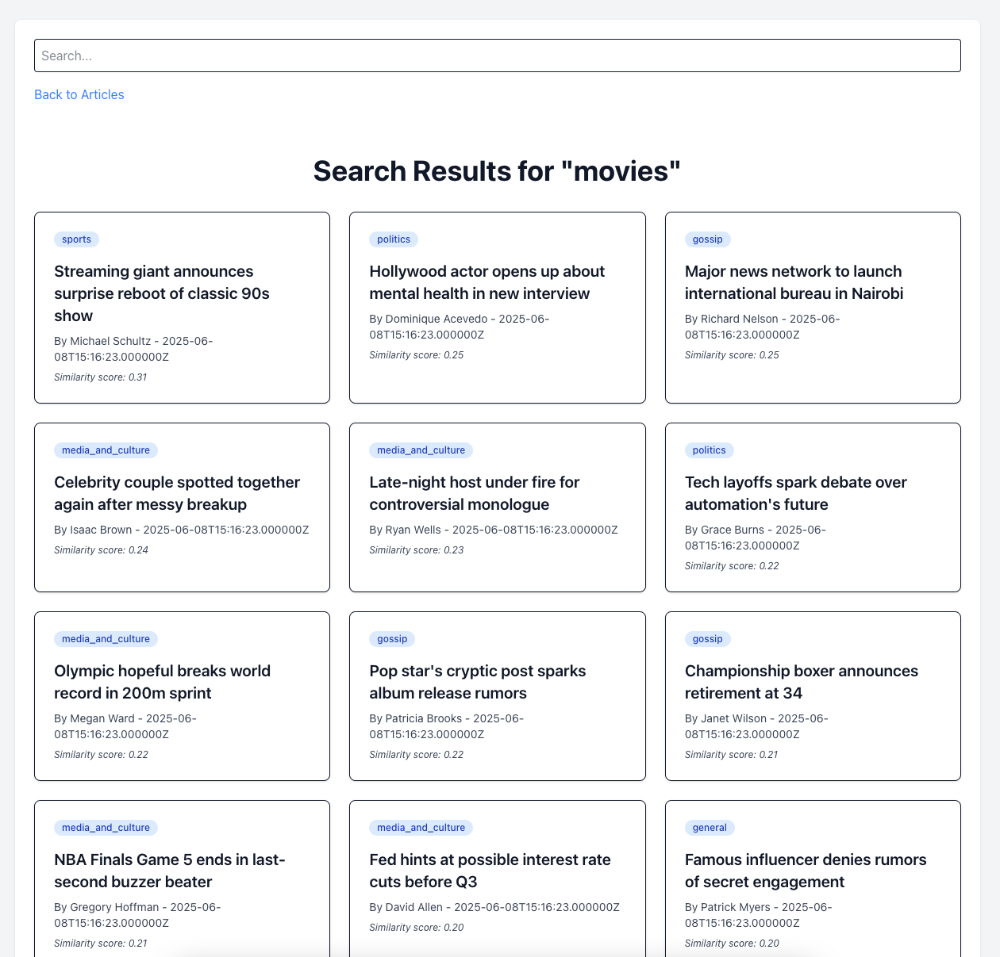

## About this project

This project is an example of how to integrate the [Timm49/similar-content](https://github.com/Timm49/similar-content) package into a Laravel project.

To showcase these features I decided on a very basic news article website (like NYT, CNN, etc)

This example includes examples for the 2 main features of the package:

- Related content recommendation section
- Semantic search

Check out the ArticleController since more or less everything relevant to the package happens in there.

## Installation

Clone via git
```bash
git clone https://github.com/Timm49/example-app-similar-content
```

Add environment variables
```env
SIMILAR_CONTENT_OPENAI_API_KEY=your-key-for-embeddings
```

Composer installation
```bash
composer install
```

Run migrations
```bash
php artisan migrate
```

Seed the database
```bash
php artisan db:seed
```

Generate embeddings (OpenAI)
```bash
php artisan similar-content:generate-embeddings
```

Serve the app
```bash
php artisan serve
npm run dev
```

### The routes:

#### /
This route shows the article index page. The "search" bar showcases how you can use the package to easily include a semantic search feature on your applicaiton.
<p>
  
</p>

### /articles/{slug}
Article show (detail) page with "related articles" recommendation section.
I displayed the similarity scores in this section to make the similarity extra clear.
<p>
  
</p>

#### /?q=SearchQuery
The route which shows the search results from the search input:
<p>
  
</p>

## Contributing
This is just an example app so I don't expect too many contributions. Feel free of course.
